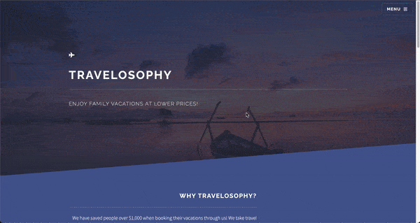

<h1 align="center">Hi 👋, I'm Tyler Gish</h1>
<h3 align="center">A passionate full-stack software engineer</h3>

  

  

- 🔭 I’m currently working on: **Codewars, personal projects and freelancing**

- 🌱 I’m currently learning: **React, Node, MongoDB**

- 👨‍💻 All of my projects are available at: [https://tylergish.netlify.app/](https://tylergish.netlify.app/)

- 📫 How to reach me: **gishtyler17@gmail.com**

- ⚡ Fun fact: **I am a Veteran**

<h3 align="left">Connect with me:</h3>

<h3 align="left">Languages and Tools:</h3>

       

<h1 align="center">Projects</h1>
<table bordercolor="#66b2b2">
  
  <tr>
    <td width="50%" valign="top">
      <h3 align="center">Divine Salon</h3>
         
        
         
        

      

      
 <strong> HTML5, CSS3, & Javascript</strong> - A fully responsive and modern website for a full-service salon.

    </td>
    <td width="50%" valign="top">
      <h3 align="center">Broken Eggs Breakfast</h3>
         
      
         
        

      

      
<strong> HTML5, CSS3, & Javascript</strong> - A family owned and operated, professional and gourmet breakfast restaurant.

    </td>
  </tr>
  
  <tr>
    <td width="50%" valign="top">
      <h3 align="center">Tyler Gish - Portfolio</h3>
       
        
       
        

      

      
<strong>HTML5, CSS3, & Javascript</strong> - Portfolio Site including links to my projects and ways to get in contact with me.

    </td>
    <td width="50%" valign="top">
      <h3 align="center">Travelosophy</h3>
         
        
         
        

      

      
<strong>HTML5, CSS3, & Javascript</strong> - A fully responsive travel website that offers vacations at discounted prices!

    </td>
  </tr>
</table>

&nbsp;

